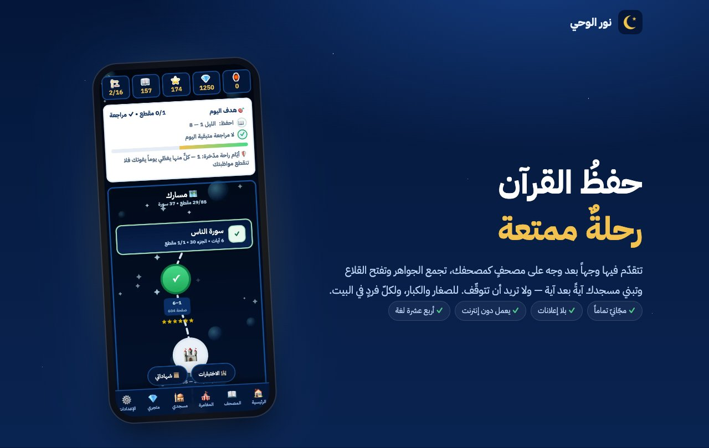
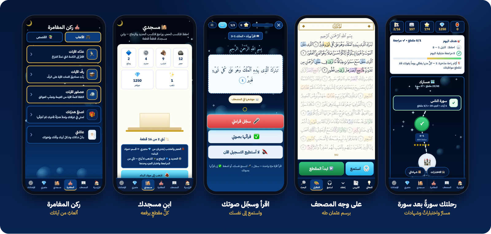

# نور الوحي

**تطبيقٌ مجّانيّ لحفظ القرآن ومراجعته، للصغار والكبار ولكلّ فردٍ في البيت**

✓ مجّانيّ تماماً &nbsp;·&nbsp; ✓ بلا إعلانات &nbsp;·&nbsp; ✓ لا يجمع بيانات &nbsp;·&nbsp; ✓ يعمل دون إنترنت &nbsp;·&nbsp; ✓ أربع عشرة لغة

**[nuralwahy.app](https://nuralwahy.app)**

 

## 📖 كيف تحفظ؟

على وجه المصحف برسم عثمان طه، كما تراه في مصحفك تماماً. يُظلَّل مقطعُك على الصفحة، ثمّ:

| | |
|:-:|---|
| **١** | **تسمع** الآيةَ بصوت قارئك المفضّل (نحو عشرين قارئاً)، وبالسرعة التي تناسبك |
| **٢** | **تقرأ وتسجّل** صوتك وتستمع إلى نفسك |
| **٣** | **تختبر نفسك**: ترتّب الكلمات، وتكمل الناقصة، وتربط الآيات حتى تثبت |
| **٤** | **تفهم ما تحفظ**: التفسير الميسّر ومعاني الكلمات، أو ترجمة المعاني بلغتك |

ثمّ **جدول مراجعة** يعيد ما حفظتَ في وقته فلا يتفلّت، مع «اختبر نفسك» وتحدٍّ يوميّ، وخطط «بالقرآن نحيا» بمقاديرَ تناسب كلَّ حافظ.

## 🗺️ مغامرةٌ لا حصّة

- خريطةٌ تسير عليها جزءاً بعد جزء، وقلاعٌ تفتحها باختبارات الأجزاء
- 🕌 مسجدٌ يرتفع بناؤه حجراً حجراً كلّما حفظت
- 🎮 ركن المغامرة: ألعابٌ من آياتك تكافئك على ما حفظت
- 📚 أكثر من ستّين قصّةً مصوّرة تُفتح في الطريق، وتصل الجديدةُ منها وحدها
- 💎 جواهر وشارات، وشهادة إتمامٍ تشاركها أهلك

## 🏠 للبيت كلّه

حسابٌ لكلّ فردٍ في البيت على الجهاز نفسه، و«لوحة البيت» تجمع تقدّم الجميع فيتنافسون في الخير، بلا منافسةٍ مع أحدٍ من خارج البيت.

## 🌍 بلغات أكثر من مليار مسلم

الواجهة والقصص بأربع عشرة لغة، ومعها ترجمةُ معاني الآيات المعتمدة في أكثرها. أمّا المصحفُ والآياتُ فبالعربيّة كما أُنزلت.

العربيّة · English · اردو · فارسی · پښتو · Türkçe · Français · Bahasa Indonesia · Bahasa Melayu · বাংলা · Kiswahili · Hausa · Soomaali · O‘zbekcha

## 🔒 آمنٌ لأطفالك

| 🚫 بلا إعلانات | 🔐 لا يجمع بيانات | 🎙️ صوتك لك | 📴 دون إنترنت |
|:-:|:-:|:-:|:-:|
| ولا مشتريات داخل التطبيق | تقدّمك في جهازك وحده | التسجيل يُسمع ثمّ يُمحى | يعمل في أيّ مكان |

التفاصيل في [سياسة الخصوصيّة](https://znammous.github.io/quran-kids/privacy.html).

 

<b>﴿وَلَقَدْ يَسَّرْنَا ٱلْقُرْءَانَ لِلذِّكْرِ فَهَلْ مِن مُّدَّكِرٍ﴾</b> 
القمر: ١٧

وقفٌ لله تعالى، وصدقةٌ جارية عن والديَّ عاطف النمّوس ولمياء القبّاني. 
لا تنسوهما من دعائكم.

 

---

<b>عن ملفّ APK</b>

 

لمن لا يوجد على جهازه متجر Google Play (مثل أجهزة هواوي الحديثة، أو حيث المتجر محجوب). ومن عنده المتجر فالأفضل له [Google Play](https://play.google.com/store/apps/details?id=io.github.znammous.nuralwahy)، فهو يتحدّث وحده.

- تحديثاتُ المحتوى تصل داخل التطبيق كالمعتاد، وتحديثاتُ النظام الأصليّ تحتاج تحميل الملفّ من جديد من [صفحة الإصدار](https://github.com/znammous/quran-kids/releases/tag/apk).
- ملفّ APK ونسخة المتجر لا يُثبَّت أحدهما فوق الآخر: للانتقال بينهما احفظ نسخةً احتياطيّة من الإعدادات أوّلاً، ثمّ احذف التطبيق وثبّت الآخر.

<b>للمطوّرين</b>

 

التطبيقُ صفحةٌ واحدة (`index.html`) تعمل في المتصفّح وتُغلَّف بـ [Capacitor](https://capacitorjs.com) لأندرويد وiOS.

| المسار | ما فيه |
|---|---|
| `index.html` | التطبيق كلّه |
| `data/` | نصّ المصحف والخطط والتفسير وترجمات المعاني (`data/tr/<لغة>/`) |
| `fonts/` | خطوط الواجهة وصفحات المصحف |
| `lang/` | قواميس الواجهة بكلّ لغة — التفاصيل في [`lang/اقرأني.md`](lang/اقرأني.md) |
| `stories/` | القصص المصوّرة، تُجلب من الشبكة فتصل الجديدةُ بلا تحديث |
| `android/` · `ios/` | مشروعا Capacitor |
| `scripts/` | بناء `www/`، وفحص الترجمة، والأيقونات، وصور المتجر (`scripts/store/`) |
| `store/` | نصوص المتجرين وصورهما بكلّ لغة |

**التشغيل محلّيّاً:** `python3 -m http.server` من جذر المستودع ثمّ افتح `http://localhost:8000` (الخادمُ لازمٌ لتسجيل الصوت).

**البناء:** `npm ci` ← `npm run www` ← `npx cap sync` ← افتح المشروع في Android Studio أو Xcode.

**الترجمة:** بعد تعديل أيّ نصٍّ في الواجهة `npm run i18n` حتى يخلو من النقص.

**التحديث الحيّ:** كلُّ رفعٍ إلى `main` يمسّ الصفحة ينشر حزمةً جديدة في Releases (`web-…`) يجلبها التطبيقُ عند الفتح، فلا تحتاج تعديلاتُ الصفحة إصداراً جديداً في المتجرين. وبناءُ أندرويد من GitHub Actions (`android.yml`).

`games.html` لمؤلّفين آخرين، وليس جزءاً من التطبيق.

